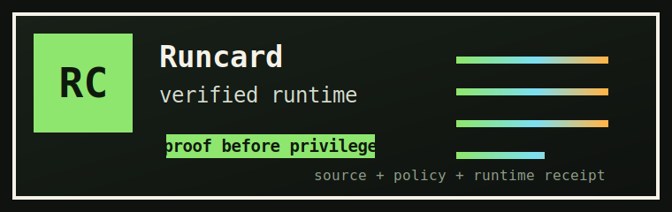

# Runcard

> **Part of a layered confidential-compute platform — run agents inside cloud TEEs (AWS Nitro · AMD SEV-SNP · Intel TDX).**  
> `agent platform` **cvm-agent** (this repo) · `attestation service` [attestation-service](https://github.com/maceip/attestation-service) · `quote format` [unified-quote](https://github.com/maceip/unified-quote) · `in-TEE runtime` [attested-workload](https://github.com/maceip/attested-workload)


Runcard is proof before privilege for agentic software.

Before an app gives an agent, MCP server, package, deploy job, or service real
power, it should be able to ask one practical question:

> Is this live thing really the reviewed source it claims to be?

Runcard is a small proof card that apps and workflows can verify before
releasing secrets, tokens, deploy rights, filesystem access, or customer data.



```ts
const verdict = await runcard.verify("https://agent.example.com", {
  source: "github.com/acme/support-flow",
  policy: "reviewed-main-only"
});

if (verdict.ok) {
  await secrets.release("PROD_SUPPORT_TOKEN");
}
```

## Why Devs Should Care

- **Agentic workflows:** prove the running workflow before it gets a GitHub,
  Linear, Stripe, or cloud token.
- **MCP tool servers:** expose discovery first, then require a receipt before
  model-controlled shell, database, browser, or filesystem tools.
- **Package promotion:** compare an ordinary CI artifact with a hardware-rooted
  rebuild witness before publishing.
- **Secret release:** let KMS, Vault, or app middleware release sensitive
  material only to a verified runtime.
- **Deploy gates:** turn attestation into a pass/fail check developers can read
  in a PR, release job, or service log.

The point is not to make everyone care about code signing. The point is to give
modern software a simple boundary: no proof, no privilege.

## What Works Today

The root implementation already proves the cryptographic core:

- Stage 0 attested build inside a TEE.
- Stage 1 attested runtime that verifies Stage 0 before serving.
- Attested TLS certificate carrying an EAT receipt.
- Recursive chain walk from runtime back to build.
- Real hardware quote verification for Intel TDX, AMD SEV-SNP, and AWS Nitro
  fixtures.
- Ouroboros CI path where this repo is built by its own attested runner.

That is the engine. Runcard is the developer-facing shape around it.

## Product Surface

### Shareable Card

A Runcard should be something a developer can show, not just a file they store.
The card is the human-facing receipt:

- verdict: `verified`, `pending`, or `failed`
- subject: the service, package, tool server, or workflow
- source: repository and commit
- policy: the rule that allowed or denied privilege
- receipt URL: the full machine-verifiable evidence

Target surfaces:

```md
[](
  https://runcard.dev/card/agent.example.com
)
```

```http
GET /.well-known/runcard/card.json
GET /.well-known/runcard/receipt
```

### App/API

Apps should not parse attestation internals. They should ask for a verdict.

```ts
const verdict = await runcard.verify(target, {
  source: "github.com/acme/support-flow",
  policy: "reviewed-main-only"
});
```

### CI Receipt

Drop one step into CI and receive `proof-receipt.json` plus the raw
`attestation.cbor` evidence.

```yaml
- uses: maceip/runcards/action@main
  with:
    source: .
    cmd: npm test && npm run build
```

Today this wrapper expects a TEE-capable runner. The mass-market path should not
ask an app team to own that runner; it should send the checked-out workspace or
artifact digest to a short-lived shadow build service and return the receipt to
the normal GitHub job. See [`SHADOW.md`](SHADOW.md).

### Policy Gate

```bash
runcard gate \
  --receipt ./proof-receipt.json \
  --policy .runcard.yml
```

Example policy:

```yaml
source: github.com/acme/support-flow
ref: refs/heads/main
require_reviewed_commit: true
allow:
  secrets:
    - PROD_SUPPORT_TOKEN
```

### Agentic Integrations

- **MCP server:** `verify_runtime`, `verify_artifact`, `explain_receipt`,
  `should_release_secret`.
- **Agent SDK guardrail:** block tool calls that would release secrets, deploy,
  mutate repos, or access customer data unless the target has a valid receipt.
- **Runtime API:** `GET /.well-known/runcard/receipt` for services that want to
  advertise their proof.
- **GitHub check summary:** a PR-level line that says whether this code can
  receive privilege.

## How The Proof Works

Stage 0 runs the build inside trusted hardware:

1. Refuses to run outside a TEE.
2. Hashes and freezes the source tree.
3. Runs the build.
4. Hashes the artifact.
5. Computes `Value X`, the portable source identity.
6. Places the binding hash into the TEE quote.
7. Emits an EAT receipt as CBOR.

Stage 1 runs the service:

1. Loads the Stage 0 receipt.
2. Verifies the Stage 0 hardware quote.
3. Recomputes `Value X` from disk.
4. Generates a TLS key inside the TEE.
5. Collects a fresh runtime quote bound to that TLS key.
6. Serves an attested TLS certificate containing the runtime receipt.

A verifier checks that the TLS key matches the receipt, the hardware quote is
signed by the pinned vendor root, the runtime chains back to the build,
`Value X` stays stable across the chain, and project policy allows that
identity to receive privilege.

## Hardware Status

| Platform | Hardware | Root of trust | Chain | Status |
|---|---|---|---|---|
| Intel TDX | GCP c3-standard-4 | Intel SGX Root CA | Stage 0 to Stage 1 | Proven |
| AMD SEV-SNP | AWS c6a.xlarge | AMD Root Key | Stage 0 to Stage 1 | Proven fixtures |
| AWS Nitro | AWS m5.xlarge enclave | AWS Nitro Root CA | Stage 0 single-process | Proven |
| Azure SEV-SNP | Azure Standard_DC4as_v5 CVM | AMD PSP + Azure vTOM | blocked before Stage 0 | Tested, not verified |

Real attestation bytes live in [`testdata/chain/`](testdata/chain). The
regression suite runs TDX and Nitro verification by default; SNP fixtures are
present but the full signature test is ignored by default because the captured
reports currently require live AMD KDS access.

## Quick Start

You need Rust installed to build the current engine locally.

```bash
git clone https://github.com/maceip/runcards
cd runcards
cargo build --release --bin runcard
cargo test
```

Run an attested build inside a TEE-capable host:

```bash
sudo ./target/release/runcard build /path/to/source \
  --cmd "your build command" \
  --output ./attest-out
```

Run an attested service:

```bash
sudo ./target/release/runcard run /path/to/source \
  --attestation ./attest-out/attestation.cbor
```

Verify it from any machine:

```bash
./target/release/runcard check https://<domain>/
```

## OpenClaw-Style Use

For a modern agentic app, the useful boundary is not "this binary is signed."
It is:

1. Build the app, tool server, package, or release artifact.
2. Get a Runcard receipt for the source and artifact.
3. Gate secrets, publish rights, deploy rights, or live tool access on that
   receipt.
4. Show the card in the PR, release page, package page, or service health view.

That flow should be usable from an ordinary GitHub-hosted job. The current
repository has the cryptographic pieces, but the next product cut is the
developer path: `proof-receipt.json`, `runcard gate`, check summaries, and a
hosted shadow receipt option for teams that do not run their own TEE hardware.

## Repo Map

- [`src/eat.rs`](src/eat.rs): EAT receipt schema and binding bytes.
- [`src/main.rs`](src/main.rs): build, run, check, enclave commands.
- [`src/quote/verify.rs`](src/quote/verify.rs): platform quote
  verification.
- [`src/registry.rs`](src/registry.rs): local verification registry.
- [`action/action.yml`](action/action.yml): GitHub Action wrapper.
- [`HOSTED_SITE.md`](HOSTED_SITE.md): local testing for the hosted
  organizer/participant website, inside or outside a TEE.
- [`SHADOW.md`](SHADOW.md): no-TEE-required shadow attestation plan.
- [`docs/index.html`](docs/index.html): public Runcard narrative and browser
  proof.

## Status

The repo root is the current codebase. The proof engine works; the next job is to make
Runcard feel like ordinary developer infrastructure:

- `proof-receipt.json`
- `runcard gate`
- GitHub Action check summaries
- MCP and agent guardrails
- shadow attestation service

## License

MIT